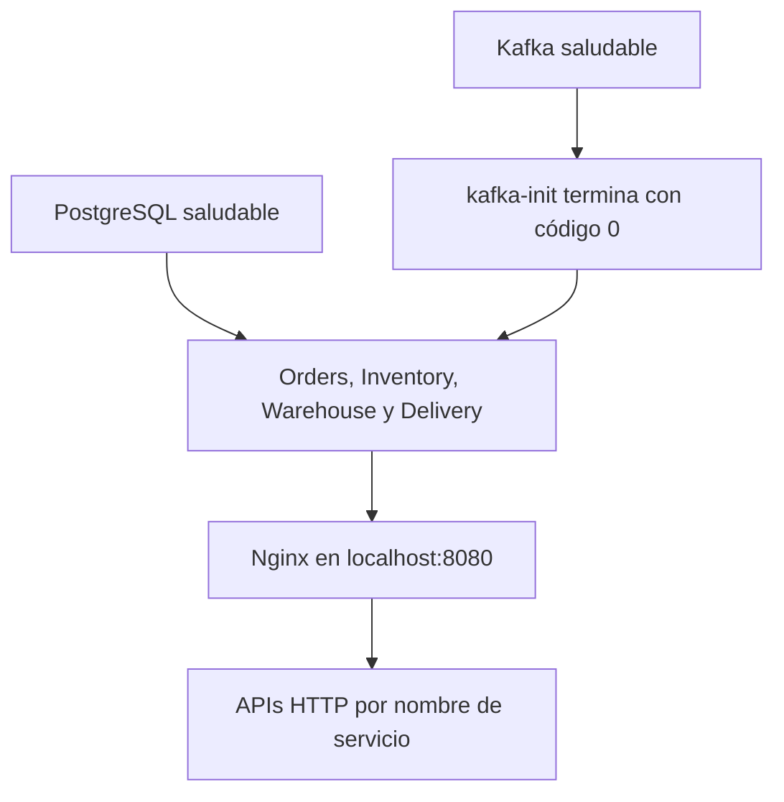

# Guía del código — alumnos 5 y 7

Revisión del 8 de octubre de 2026 sobre `e66e3b3` con los cambios de
`origin/develop` hasta `7501596` integrados, pendientes de commit de fusión.
Complementa el [manual técnico y de usuario](MANUAL.md). Esta guía describe
los otros módulos mediante lectura; su implementación pertenece a sus autores.

## Responsabilidades y mapa de archivos

| Responsable | Archivos | Función |
|---|---|---|
| Alumno 1 | `services/orders/app.py` | API de pedidos, validación, persistencia, publicación e historial. |
| Alumno 2 | `services/inventory/app.py` | API de existencias, reserva transaccional y consumo de `ORDER_CREATED`. |
| Alumno 3 | `services/warehouse/app.py` | Preparación y publicación de `ORDER_READY`. |
| Alumno 4 | `services/delivery/app.py` | Asignación de flota y etapas de reparto. |
| Alumno 5 | `compose.yaml`, `common/`, `contracts/`, `infrastructure/` | Arranque, conexiones, sobre de eventos y esquema compartido. Mejora: `scripts/health_platform.py`. |
| Alumno 6 | `frontend/` | Interfaz HTML/CSS/JavaScript y proxy Nginx. |
| Alumno 7 | `docs/`, `README.md`, evidencias autorizadas en `tests/` | Manual, catálogo, matriz y documentación de QA. Mejora existente: `scripts/acceptance_flow.py`. |

Los Dockerfiles y `requirements.txt` de cada servicio preparan su entorno.
`requirements-dev.txt` contiene las dependencias de pytest y los módulos que
importan las pruebas. `pytest.ini` configura su ejecución. El workflow
`.github/workflows/tests.yml` tiene trabajos separados para pytest y Compose.

## Arranque y red de infraestructura

`x-app-environment` y su ancla YAML comparten `DATABASE_URL`,
`KAFKA_BOOTSTRAP_SERVERS` y salida Python sin búfer. Las credenciales obligatorias
se interpolan desde el entorno o `.env`; no tienen valor de respaldo en Compose.

PostgreSQL 16 monta `postgres_data` y ejecuta `01-init.sql` cuando inicializa
un directorio de datos vacío. Kafka 4.1.0 usa un único nodo KRaft con funciones
de broker y controller. No hay ZooKeeper ni volumen persistente de Kafka
declarado en este Compose: la persistencia de PostgreSQL no implica conservar
mensajes al recrear el broker.

`kafka-init` crea seis topics con tres particiones y factor de replicación 1.
`--if-not-exists` permite repetirlo; `set -e` propaga un fallo. El comando es
un único argumento de `bash -c`; `$$topic` evita que Compose lo sustituya antes
de ejecutar el bucle. Su estado normal final es `exited` con código 0.

Todos los servicios usan la red bridge `logistitrack`. Kafka anuncia
`kafka:9092`, pensado para clientes dentro de Docker; publicar el puerto 9092
no configura por sí solo un listener para clientes externos. Los comandos de
diagnóstico Kafka se ejecutan dentro de su contenedor.

Los siete servicios de larga duración tienen healthcheck. Las aplicaciones
esperan PostgreSQL saludable y la finalización de `kafka-init`. Frontend espera
Orders saludable y los otros tres servicios iniciados. Esta condición inicial
no certifica que todos los consumidores estén conectados permanentemente.

## Biblioteca compartida: entradas, resultados y errores

| Función | Entrada y resultado | Efectos y límites |
|---|---|---|
| `database.get_connection()` | Lee `DATABASE_URL`; devuelve conexión psycopg. | Sin pool. Falta de variable: `RuntimeError`. El llamador cierra y administra transacciones. |
| `events.build_event(type, order_id, source, payload)` | Devuelve diccionario con siete campos, UUID y fecha UTC nuevos. | Conserva la referencia a `payload`; no valida ni publica. |
| `events.validate_event(event)` | Devuelve `None` o lanza `ValueError`. | Comprueba el sobre, no la semántica del payload ni la existencia del pedido. |
| `kafka_client.create_producer()` | Productor configurado por entorno. | No prueba conectividad al construirlo. |
| `kafka_client.publish_confirmed(producer, topic, event, key=None, timeout=5)` | Serializa JSON, produce y espera confirmación. | `PublishError` si quedan mensajes, falta callback o este informa error. No valida el sobre. |
| `kafka_client.publish(producer, topic, event)` | Valida y publica; devuelve `None`. | Si el sobre es inválido, publica en `dead-letter`. Los fallos de entrega se propagan. |
| `kafka_client.publish_dead_letter(producer, event, reason, source)` | Genera `PROCESSING_FAILED`. | Usa `PED-000000` si el ID original es inválido; conserva original y error en payload. |
| `kafka_client.create_consumer(group_id, topics)` | Consumidor suscrito sin commit automático. | `earliest` solo aplica sin offset válido. El llamador controla `poll`, `commit` y `close`. |

La validación manual sigue las restricciones principales del esquema JSON,
pero no ejecuta un motor JSON Schema. Por ejemplo, usa `datetime.fromisoformat`
para las fechas; no se debe asumir equivalencia completa con `format: date-time`.
El esquema permite cualquier objeto como payload. Los nombres oficiales de
eventos son un acuerdo documentado, no un enum aplicado por el validador.

Confirmación del broker no significa entrega exactamente una vez. Si hay un
timeout, el mensaje puede haber llegado y el reintento puede duplicarlo.
PostgreSQL y Kafka no comparten una transacción atómica en este proyecto.

## Recorrido interno del código de negocio

### Orders

`validate_order_payload` verifica objeto JSON, dirección de 1 a 200 caracteres
tras quitar espacios, lista no vacía y cantidades enteras positivas (excluye
booleanos). Detecta identificadores de producto repetidos tras quitar espacios.
Devuelve el código de error o `None`. `create_order` normaliza dirección y
productos, consulta precios y rechaza productos inexistentes con 400.
Persiste pedido, partidas e historial `RECEIVED` en una transacción; el ID
lo obtiene de la secuencia de PostgreSQL. Después publica `ORDER_CREATED`.
Devuelve 201 con `order_id`, `status`, `total` e `items` al confirmar el envío.
Un fallo SQL devuelve 503 `DATABASE_UNAVAILABLE`; si falla Kafka devuelve
503 `KAFKA_UNAVAILABLE` y el ID del pedido ya persistido. No hay outbox ni
reintento automático de esa publicación en Orders.

`list_orders` ordena por fecha descendente. `get_order` consulta pedido,
historial por `history_id` y partidas por producto mediante parámetros SQL.
Ambos transforman importes a `float` y fechas a ISO; devuelven 503 ante errores
de base. `get_order` distingue el 404. `list_products` devuelve `[]`.

### Inventory

`fetch_inventory` une catálogo con existencias y agrupa por producto con
stock de Norte y Sur. `requested_quantities` valida y suma partidas repetidas.
`choose_warehouse` busca primero Norte y después Sur: todo el pedido debe
salir de un solo almacén, aunque la suma de ambos alcance.

`reserve_inventory` inserta la marca de idempotencia, bloquea pedido y stock
con `FOR UPDATE`, descuenta o rechaza y guarda estado, historial y evento de
respuesta en una transacción. Exige un pedido existente en `RECEIVED`.
Ante el mismo `event_id`, recupera el resultado guardado sin descontar otra vez.

`process_order_event` publica ese resultado en `inventory` y `order-status`.
`consume_orders` envía datos inválidos a dead-letter; solo confirma el offset
tras procesar o confirmar ese envío. Ante otros errores reconecta después de
cinco segundos. Su grupo es `inventory-service`.

### Warehouse

`process_inventory_event` acepta únicamente `INVENTORY_RESERVED` y omite
eventos ya registrados. `save_order_status` bloquea el pedido, comprueba el
estado anterior y evita retroceder un pedido avanzado. Guarda cada cambio
en `orders` y `order_history`.

`calculate_preparation_seconds` multiplica la base por cantidad y tipo:
normal 1, pesado 2, frágil 1.5 y refrigerado 1.3. Limita la espera a 30 segundos.
Publica `PREPARING`, después `READY_FOR_DELIVERY` en `order-status` y
`ORDER_READY` en `warehouse`; marca procesado al concluir las publicaciones.
`build_warehouse_event` genera UUID deterministas por evento de reserva y
tipo de salida; un reintento conserva esos IDs, aunque se regenere la fecha.

`consume_reservations` usa `warehouse-service`, confirma manualmente y
reconecta tras cinco segundos. `/health` informa `kafka_connected`, contadores
y último error; responde 503 si el estado local indica desconexión. Ese estado
es diagnóstico del bucle consumidor, no una verificación activa del broker
en cada solicitud HTTP.

### Delivery

`decode_event` valida JSON y sobre. `DeliveryStore.initialize` crea sus dos
tablas propias. `advance` bloquea asignaciones con un advisory lock transaccional
y el pedido con `FOR UPDATE`. Elige una de tres parejas conductor/vehículo
libres y persiste una etapa, historial y evento en la misma transacción.

`run_delivery` recupera publicaciones guardadas y avanza por `DRIVER_ASSIGNED`,
`IN_TRANSIT`, `NEAR_DESTINATION`, `DELIVERED`. Los UUID de salida son
deterministas por pedido y etapa. `publish_stage` envía todas las etapas a
`order-status` y solo tránsito/entrega a `deliveries`.

`process_message` usa un bloqueo de sesión por pedido para coordinar réplicas.
Los errores recuperables lanzan `RetryLater`, sin confirmar offset. Los
mensajes inválidos generan dead-letter con motivo, topic, partición y offset;
esta variante no conserva el evento original. El grupo `delivery-service`
reintenta tras tres segundos. La espera configurada debe estar entre 0 y 30.

### Frontend y proxy

`index.html` define salud, formulario, tablero, seguimiento e inventario;
`styles.css` controla la presentación. `api.js` centraliza rutas, codifica IDs,
ejecuta `fetch` y convierte errores HTTP/red en mensajes. `app.js` mantiene el
borrador, agrega cantidades, normaliza inventario y renderiza consultas REST.
El navegador no consume Kafka directamente.

`nginx.conf` sirve estáticos, resuelve contenedores mediante `127.0.0.11`,
reenvía los prefijos de cada API y traduce las rutas de salud a `/health`.
`/frontend-health` comprueba el servidor web; no comprueba PostgreSQL ni Kafka.

## Diccionario de almacenamiento

| Tabla / secuencia | Claves y datos | Uso |
|---|---|---|
| `products` | PK `product_id`; nombre, descripción, precio no negativo. | Catálogo semilla. |
| `inventory` | PK `(product_id, warehouse)`; FK a producto; cantidad no negativa. | Existencias en `NORTE`/`SUR`. |
| `processed_events` | PK `(event_id, service_name)`; fecha. | Deduplíca por consumidor. |
| `inventory_reservations` | PK `event_id`; pedido, resultado, almacén opcional, `result_event` JSONB. | Recupera la publicación de la reserva. `order_id` no declara FK aquí. |
| `order_number_seq` | Rango 1–999999, sin ciclo. | Genera el sufijo de `PED-000001`. |
| `orders` | PK `order_id`; total, fecha, dirección, estado, conductor/vehículo opcionales. | Estado actual. Delivery usa su propia tabla de asignaciones. |
| `order_items` | PK `(order_id, product_id)`; dos FK; cantidad positiva. | Partidas del pedido. |
| `order_history` | PK `history_id`; FK pedido; estado, fecha, evento opcional. | Historial visible. Las columnas opcionales de evento no son el almacén usado por Delivery. |
| `delivery_assignments` | PK y FK `order_id`; conductor y vehículo. | Creada por Delivery al iniciar. |
| `delivery_events` | PK `event_id`; FK pedido; único `(order_id, status)`; evento JSONB. | Creada por Delivery para recuperación. |

El SQL inicial usa `CREATE ... IF NOT EXISTS` y semillas con
`ON CONFLICT DO NOTHING`: no es un sistema de migraciones y no repone stock
ya consumido. Añadir columnas al archivo no actualiza un volumen existente.

## Scripts y automatización

| Archivo | Comportamiento | Alcance de su resultado |
|---|---|---|
| `scripts/smoke_base.py` | Consulta endpoints de salud HTTP. | Arranque básico, sin pedido entregado. |
| `scripts/health_platform.py` | Inspecciona ocho servicios, volumen, endpoints y seis topics. | Sale 0 si todos sus chequeos pasan; 1 en caso contrario. |
| `scripts/acceptance_flow.py` | Consulta proxy, servicios, listas, alta inválida y alta válida. Espera el historial ordenado hasta `DELIVERED`. | Sale 0 solo con ese recorrido. Un 501, un rechazo o un historial a medias sale 1. |
| `.github/workflows/tests.yml` | Python 3.12, dependencias, pytest; otro job construye Compose y reintenta salud hasta 36 veces. | No ejecuta aceptación de negocio completa. |

El script de salud tolera JSON de Compose en array o por línea. Ejecuta Docker
desde la raíz del proyecto, con timeout de 45 segundos por comando. Inspecciona
que el volumen sea escribible, tenga destino correcto y etiqueta Compose
`postgres_data`. Exige `healthy` en los siete servicios de larga duración.
`kafka-init` se acepta solo si terminó con código 0. El HTTP comprueba el
código 2xx y no el cuerpo JSON. Una tarea one-off de Compose no cuenta como
el contenedor del servicio.

Las variables `PLATFORM_FRONTEND_HEALTH_URL`, `PLATFORM_ORDERS_HEALTH_URL`,
`PLATFORM_INVENTORY_HEALTH_URL`, `PLATFORM_WAREHOUSE_HEALTH_URL` y
`PLATFORM_DELIVERY_HEALTH_URL` sustituyen los endpoints de ese script.
`ACCEPTANCE_BASE_URL` configura la aceptación y `DELIVERY_TEST_DATABASE_URL`
habilita la prueba SQL opcional. Son variables del proceso que ejecuta cada
script; este no carga `.env` automáticamente.

Para comandos operativos consultar [salud](INFRA_HEALTH.md) y
[Kafka](INFRA_KAFKA.md). Para resultados medidos y pendientes consultar
[QA](QA_RESULTADOS.md).
